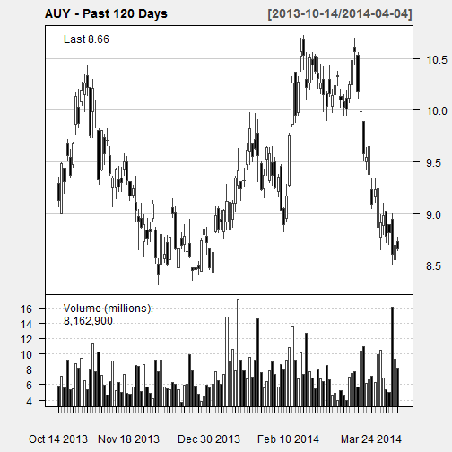
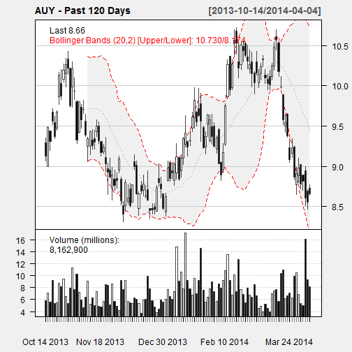
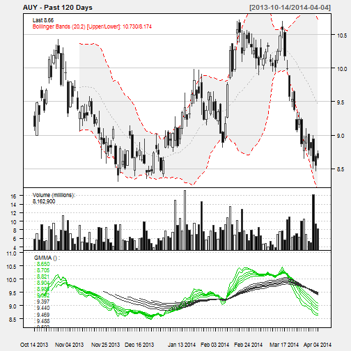

# Quantmod Stock Scanner


```
## Warning: package 'quantmod' was built under R version 3.0.2
```

```
## Loading required package: Defaults
## Loading required package: xts
```

```
## Warning: package 'xts' was built under R version 3.0.2
```

```
## Loading required package: zoo
## 
## Attaching package: 'zoo'
## 
## The following object is masked from 'package:base':
## 
##     as.Date, as.Date.numeric
## 
## Loading required package: TTR
## Version 0.4-0 included new data defaults. See ?getSymbols.
##     As of 0.4-0, 'getSymbols' uses env=parent.frame() and
##  auto.assign=TRUE by default.
## 
##  This  behavior  will be  phased out in 0.5-0  when the call  will
##  default to use auto.assign=FALSE. getOption("getSymbols.env") and 
##  getOptions("getSymbols.auto.assign") are now checked for alternate defaults
## 
##  This message is shown once per session and may be disabled by setting 
##  options("getSymbols.warning4.0"=FALSE). See ?getSymbol for more details
## pausing 1 second between requests for more than 5 symbols
## pausing 1 second between requests for more than 5 symbols
## pausing 1 second between requests for more than 5 symbols
## pausing 1 second between requests for more than 5 symbols
## pausing 1 second between requests for more than 5 symbols
## pausing 1 second between requests for more than 5 symbols
## pausing 1 second between requests for more than 5 symbols
## pausing 1 second between requests for more than 5 symbols
## pausing 1 second between requests for more than 5 symbols
## pausing 1 second between requests for more than 5 symbols
## pausing 1 second between requests for more than 5 symbols
## pausing 1 second between requests for more than 5 symbols
## pausing 1 second between requests for more than 5 symbols
## pausing 1 second between requests for more than 5 symbols
## pausing 1 second between requests for more than 5 symbols
## pausing 1 second between requests for more than 5 symbols
## pausing 1 second between requests for more than 5 symbols
## pausing 1 second between requests for more than 5 symbols
## pausing 1 second between requests for more than 5 symbols
## pausing 1 second between requests for more than 5 symbols
## pausing 1 second between requests for more than 5 symbols
## pausing 1 second between requests for more than 5 symbols
## pausing 1 second between requests for more than 5 symbols
## pausing 1 second between requests for more than 5 symbols
## pausing 1 second between requests for more than 5 symbols
## pausing 1 second between requests for more than 5 symbols
## pausing 1 second between requests for more than 5 symbols
## pausing 1 second between requests for more than 5 symbols
## pausing 1 second between requests for more than 5 symbols
## pausing 1 second between requests for more than 5 symbols
## pausing 1 second between requests for more than 5 symbols
## pausing 1 second between requests for more than 5 symbols
## pausing 1 second between requests for more than 5 symbols
## pausing 1 second between requests for more than 5 symbols
## pausing 1 second between requests for more than 5 symbols
## pausing 1 second between requests for more than 5 symbols
## pausing 1 second between requests for more than 5 symbols
## pausing 1 second between requests for more than 5 symbols
## pausing 1 second between requests for more than 5 symbols
## pausing 1 second between requests for more than 5 symbols
## pausing 1 second between requests for more than 5 symbols
## pausing 1 second between requests for more than 5 symbols
## pausing 1 second between requests for more than 5 symbols
## pausing 1 second between requests for more than 5 symbols
## pausing 1 second between requests for more than 5 symbols
## pausing 1 second between requests for more than 5 symbols
## pausing 1 second between requests for more than 5 symbols
## pausing 1 second between requests for more than 5 symbols
## pausing 1 second between requests for more than 5 symbols
## pausing 1 second between requests for more than 5 symbols
## pausing 1 second between requests for more than 5 symbols
## pausing 1 second between requests for more than 5 symbols
## pausing 1 second between requests for more than 5 symbols
## pausing 1 second between requests for more than 5 symbols
## pausing 1 second between requests for more than 5 symbols
## pausing 1 second between requests for more than 5 symbols
## pausing 1 second between requests for more than 5 symbols
## pausing 1 second between requests for more than 5 symbols
## pausing 1 second between requests for more than 5 symbols
## pausing 1 second between requests for more than 5 symbols
```

```
##  [1] "AUY"  "XLK"  "AAPL" "MSFT" "VZ"   "IBM"  "T"    "ORCL" "QCOM" "CSCO"
## [11] "INTC" "V"    "FB"   "MA"   "EBAY" "EMC"  "TXN"  "ACN"  "HPQ"  "ADP" 
## [21] "YHOO" "CRM"  "CTSH" "ADBE" "GLW"  "AMAT" "MU"   "TEL"  "INTU" "CTL" 
## [31] "SNDK" "WDC"  "STX"  "ADI"  "BRCM" "FIX"  "APH"  "XLNX" "FISV" "NTAP"
## [41] "KLAC" "ALTR" "ADSK" "LLTC" "AKAM" "CTXS" "RHT"  "CA"   "NVDA" "MCHP"
## [51] "EA"   "CSC"  "WU"   "LRCX" "HRS"  "TDC"  "FFIV" "VRSN" "FTR"  "FLIR"
## [61] "TSS"  "WIN"  "FSLR" "JBL"
```


```r
# Scan for buy/sell signals based on Bollinger Bands
bbscan(stocklist)
```

```
## [1] "AUY"
## [1] "XLK"
## [1] "AAPL"
## [1] "MSFT"
## [1] "VZ"
## [1] "IBM"
## [1] "T"
## [1] "ORCL"
## [1] "QCOM"
## [1] "CSCO"
## [1] "INTC"
## [1] "V"
## [1] "FB"
## [1] "MA"
## [1] "EBAY"
## [1] "EMC"
## [1] "TXN"
## [1] "ACN"
## [1] "HPQ"
## [1] "ADP"
## [1] "YHOO"
## [1] "CRM"
## [1] "CTSH"
## [1] "ADBE"
## [1] "GLW"
## [1] "AMAT"
## [1] "MU"
## [1] "TEL"
## [1] "INTU"
## [1] "CTL"
## [1] "SNDK"
## [1] "WDC"
## [1] "STX"
## [1] "ADI"
## [1] "BRCM"
## [1] "FIX"
## [1] "APH"
## [1] "XLNX"
## [1] "FISV"
## [1] "NTAP"
## [1] "KLAC"
## [1] "ALTR"
## [1] "ADSK"
## [1] "LLTC"
## [1] "AKAM"
## [1] "CTXS"
## [1] "RHT"
## [1] "CA"
## [1] "NVDA"
## [1] "MCHP"
## [1] "EA"
## [1] "CSC"
## [1] "WU"
## [1] "LRCX"
## [1] "HRS"
## [1] "TDC"
## [1] "FFIV"
## [1] "VRSN"
## [1] "FTR"
## [1] "FLIR"
## [1] "TSS"
## [1] "WIN"
## [1] "FSLR"
## [1] "JBL"
```

```
##    stock                 pctB signal
## 1    AUY    0.206466450870453      -
## 2    XLK     0.20573929496527      -
## 3   AAPL    0.350790204600329      -
## 4   MSFT    0.555552234072321      -
## 5     VZ    0.888943195577307      -
## 6    IBM    0.693717829024353      -
## 7      T    0.825565262748095      -
## 8   ORCL    0.699673316781108      -
## 9   QCOM    0.592754575215002      -
## 10  CSCO    0.795710806909593      -
## 11  INTC    0.902242670576728      -
## 12     V  -0.0617872104061699    Buy
## 13    FB   0.0194499463315482      -
## 14    MA   0.0187874715115589      -
## 15  EBAY  -0.0147701694032187    Buy
## 16   EMC    0.415823094468644      -
## 17   TXN    0.507356286832614      -
## 18   ACN    0.044380555687314      -
## 19   HPQ    0.719789260034734      -
## 20   ADP -0.00456751022544579    Buy
## 21  YHOO  -0.0192139206531828    Buy
## 22   CRM   0.0495382270415806      -
## 23  CTSH    0.464748183925164      -
## 24  ADBE   -0.115126146600883    Buy
## 25   GLW    0.896739074519881      -
## 26  AMAT    0.661715205839446      -
## 27    MU    0.129453537460234      -
## 28   TEL    0.655855529487138      -
## 29  INTU   0.0936107734769109      -
## 30   CTL    0.950759601977856      -
## 31  SNDK    0.685666204741909      -
## 32   WDC    0.670958073245452      -
## 33   STX    0.751305935679233      -
## 34   ADI    0.598846781135985      -
## 35  BRCM    0.350395720956698      -
## 36   FIX    0.151550899630948      -
## 37   APH    0.722217544719936      -
## 38  XLNX    0.334803987544749      -
## 39  FISV    0.473419330476933      -
## 40  NTAP    0.692609290635984      -
## 41  KLAC    0.615171023675207      -
## 42  ALTR  -0.0473880819235522    Buy
## 43  ADSK   0.0383282911665125      -
## 44  LLTC    0.575130240890703      -
## 45  AKAM   -0.204603463008154    Buy
## 46  CTXS   0.0461073928973251      -
## 47   RHT  -0.0198325191046121    Buy
## 48    CA    0.303682380666992      -
## 49  NVDA    0.438192024398627      -
## 50  MCHP    0.500000000000012      -
## 51    EA    0.166017629232127      -
## 52   CSC    0.237068260462474      -
## 53    WU    0.475993264290779      -
## 54  LRCX    0.676486723821373      -
## 55   HRS    0.218916455064113      -
## 56   TDC    0.608485282731105      -
## 57  FFIV   0.0986438559155186      -
## 58  VRSN  -0.0203455211222313    Buy
## 59   FTR     0.70263354482306      -
## 60  FLIR    0.877603472489628      -
## 61   TSS    0.186625724993468      -
## 62   WIN    0.920984727204392      -
## 63  FSLR    0.652884709595138      -
## 64   JBL    0.838184326710749      -
```

```r

# Chart to see what's going on.
chartStock("AUY", 120)
```

  

```r
addGuppy()
```

 


